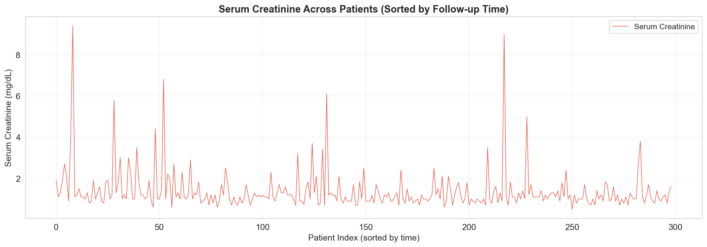
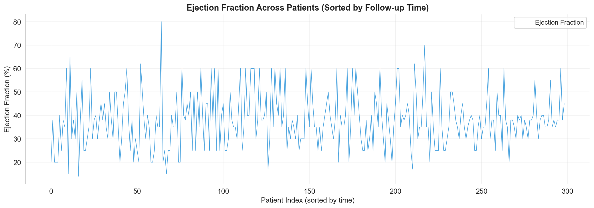
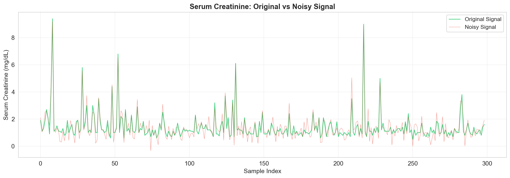
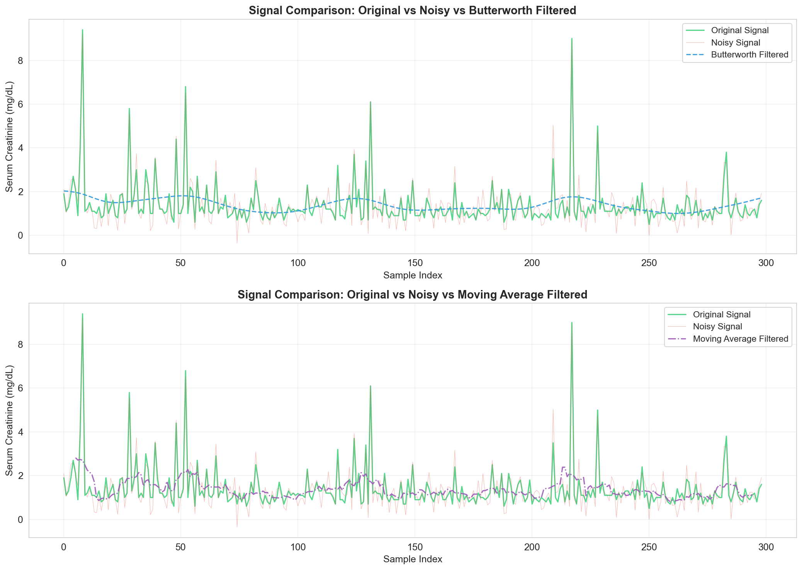
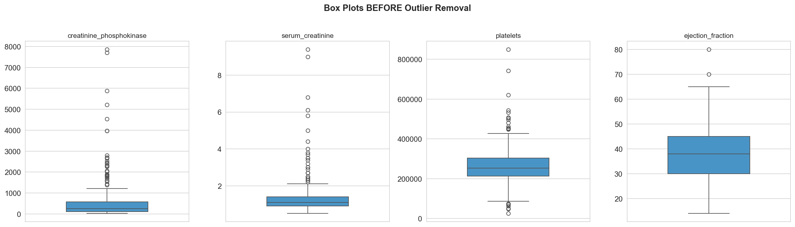
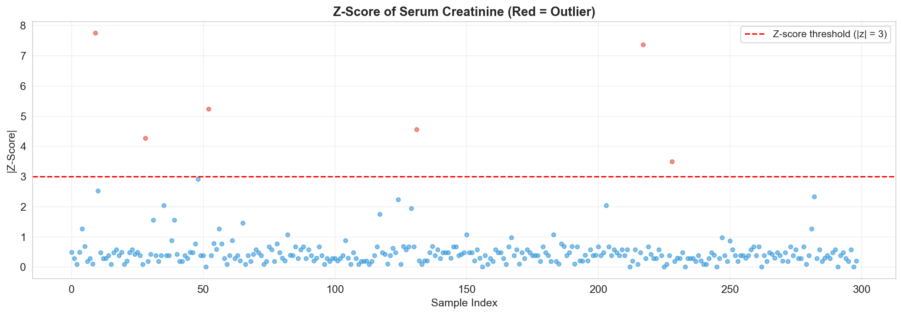
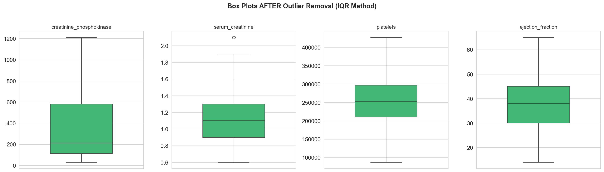
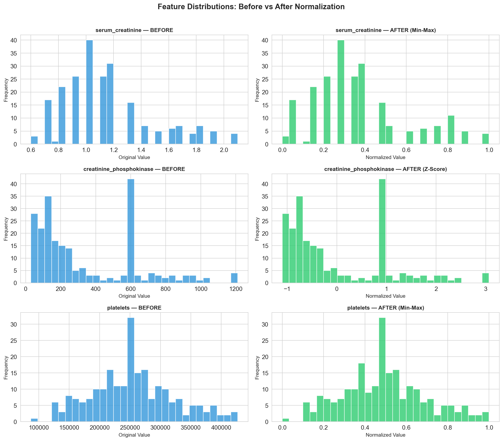

# Heart Failure Clinical Records — Data Analytics Task 1

**Cairo University — Faculty of Engineering**
**Course:** Biomedical Data Analytics
**Student:** Mahmoud Mohamed Abdelfattah
**ID:** 4220142

---

## Overview

This project applies data exploration, visualization, signal filtering, cleaning, and normalization techniques on the [Heart Failure Clinical Records](https://archive.ics.uci.edu/ml/datasets/Heart+failure+clinical+records) dataset (299 patients, 13 features).

## Dataset

| Feature | Description |
|---------|-------------|
| `age` | Age of the patient (years) |
| `anaemia` | Decrease of red blood cells (0/1) |
| `creatinine_phosphokinase` | Level of CPK enzyme in blood (mcg/L) |
| `diabetes` | If the patient has diabetes (0/1) |
| `ejection_fraction` | Percentage of blood leaving the heart per contraction |
| `high_blood_pressure` | If the patient has hypertension (0/1) |
| `platelets` | Platelet count in blood (kiloplatelets/mL) |
| `serum_creatinine` | Level of serum creatinine in blood (mg/dL) |
| `serum_sodium` | Level of serum sodium in blood (mEq/L) |
| `sex` | Sex of the patient (0 = Female, 1 = Male) |
| `smoking` | If the patient smokes (0/1) |
| `time` | Follow-up period (days) |
| `DEATH_EVENT` | If the patient died during follow-up (0/1) |

## Notebook Structure

### Part 1 — Data Exploration
- Data types inspection (binary vs. continuous features)
- Missing & suspicious values detection (platelets placeholder `263358.03` flagged)
- Descriptive statistics & conclusions

### Part 2 — Visualization & Filtering
- Line plots of **serum_creatinine** and **ejection_fraction** (sorted by follow-up time)
- Simulated **Gaussian noise** on serum_creatinine
- Applied **Butterworth low-pass filter** (justified: maximally flat passband, ideal for biomedical signals)
- Comparison with **Moving Average** filter
- Combined plot of original, noisy, and filtered signals

### Part 3 — Cleaning & Normalization
- Replaced placeholder values → **median imputation** (robust to outliers)
- Outlier detection using **IQR** and **Z-score** methods
- Chose **IQR** for removal (justified: distribution-free, works for skewed clinical data)
- Normalization:
  - `serum_creatinine` → **Min-Max** (bounded range after cleaning)
  - `creatinine_phosphokinase` → **Z-Score** (approximately normal after cleaning)
  - `platelets` → **Min-Max** (defined physiological range)

## Screenshots

### Line Plots
| Serum Creatinine | Ejection Fraction |
|:---:|:---:|
|  |  |

### Signal Filtering
| Original vs Noisy | Butterworth & Moving Average Comparison |
|:---:|:---:|
|  |  |

### Outlier Detection
| Box Plots Before Removal | Z-Score Scatter |
|:---:|:---:|
|  |  |

### Outlier Removal & Normalization
| Box Plots After Removal | Normalization Before vs After |
|:---:|:---:|
|  |  |

## How to Run

1. Clone this repository
2. Make sure you have Python 3.x installed with the following packages:
   ```
   pip install pandas numpy matplotlib seaborn scipy scikit-learn
   ```
3. Open `Task1_Heart_Failure_Analysis.ipynb` in Jupyter Notebook or VS Code
4. Run all cells sequentially

## Files

```
├── README.md
├── heart_failure_clinical_records_dataset.csv
├── Task1_Heart_Failure_Analysis.ipynb
└── screenshots/
    ├── 01_lineplot_serum_creatinine.png
    ├── 02_lineplot_ejection_fraction.png
    ├── 03_original_vs_noisy.png
    ├── 04_filtered_signals_comparison.png
    ├── 05_boxplots_before_outlier_removal.png
    ├── 06_zscore_outlier_scatter.png
    ├── 07_boxplots_after_outlier_removal.png
    └── 08_normalization_before_after.png
```
